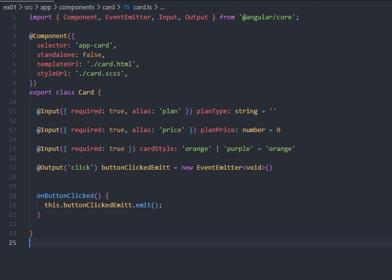

Meu mini projeto Angular 🎯

<p align="center">
  
</p>

> Um README descontraído para registrar meu passo a passo aprendendo Angular — simples, visual e pronto pra mostrar no GitHub.

---

## Sobre o projeto

Um pequeno experimento em Angular: componentes reutilizáveis (`Card` e `Button`), um `ComponentsModule` para agrupar tudo, e um `App` que exibe cards com planos (Simples / Completo). Ideal para treinar comunicação entre componentes, `@Input`, `@Output` e estilos com SCSS.

Perfeito como exercício para entender a estrutura de módulos, bootstrapping e como criar componentes coesos.

---

## Por que fiz isso

* Para praticar a criação e exportação de componentes em um módulo.
* Testar comunicação pai-filho (`@Input` / `@Output`).
* Organizar estilos com SCSS (BEM-like) e brincar com sinal (`signal`) no componente principal.
* Ter um projeto pequeno para compartilhar e evoluir.

---

## Tecnologias

* Angular (versão recente — bootstrapping manual com `platformBrowser().bootstrapModule(...)`)
* TypeScript
* SCSS
* HTML

---

## Estrutura rápida (arquivos importantes)

```
src/
├─ app/
│  ├─ app.ts          # Componente principal (App)
│  ├─ app.html        # Template do App
│  ├─ app.scss        # Estilos do App
│  ├─ app-module.ts   # AppModule e bootstrap
│  └─ components/
│     ├─ components.module.ts
│     ├─ card/
│     │  ├─ card.ts
│     │  ├─ card.html
│     │  └─ card.scss
│     └─ button/
│        ├─ button.ts
│        ├─ button.html
│        └─ button.scss
├─ index.html
└─ main.ts            # platformBrowser().bootstrapModule(AppModule)
```

---

## O que acontece aqui? (em palavras simples)

* `AppModule` importa `ComponentsModule` que declara/exports `Card` e `Button`.
* `App` exibe dois `app-card` com propriedades diferentes (`plan`, `price`, `cardStyle`).
* `Card` recebe `@Input` para tipo e preço, escolhe a classe SCSS com base em `cardStyle` e delega a ação do clique para o `Button` via `@Output`.
* `Button` emite um evento `clicked` quando pressionado — o `App` captura e executa `onCardButtonClicked()` (no exemplo, só um `console.log("Chamada Http")`).

---

## Trechos úteis do projeto

### Bootstrap (main)

```ts
import { platformBrowser } from '@angular/platform-browser';
import { AppModule } from './app/app-module';

platformBrowser().bootstrapModule(AppModule)
  .catch(err => console.error(err));
```

### App (exemplo)

```ts
import { Component, signal } from '@angular/core';

@Component({
  selector: 'app-root',
  templateUrl: './app.html',
  standalone: false,
  styleUrl: './app.scss'
})
export class App {
  protected readonly title = signal('ex01');

  onCardButtonClicked() {
    console.log("Chamada Http")
  }
}
```

### Card (entrada/saída)

```ts
@Input({ required: true, alias: 'plan' }) planType: string = ''
@Input({ required: true, alias: 'price' }) planPrice: number = 0
@Input({ required: true }) cardStyle: 'orange' | 'purple' = 'orange'
@Output('click') buttonClickedEmitt = new EventEmitter<void>()
```

---

## Como rodar (passos rápidos)

1. Clone o repositório

```bash
git clone <seu-repo-url>
cd <seu-projeto>
```

2. Instale dependências

```bash
npm install
```

3. Rode em modo desenvolvimento

```bash
ng serve
# ou (dependendo da configuração do projeto)
npm start
```

4. Abra `http://localhost:4200` e divirta-se! 🎉

---

## Ideias para evoluir o projeto (próximos passos)

* Fazer o clique do botão disparar uma requisição real (usar `HttpClient`) e mostrar feedback (toasts / loading).
* Adicionar roteamento e uma página de detalhes do plano.
* Tornar `Card` completamente standalone (e reutilizável em outros projetos).
* Testes unitários para `Card` e `Button`.
* Tornar os preços dinâmicos e consumir uma API fake (json-server).

---

## Boas práticas e toques pessoais

* Use nomes consistentes para classes SCSS (eu utilizei um padrão BEM-like).
* Separe apresentação (SCSS) da lógica (TS) — facilita testes e manutenção.
* Componentize sempre que repetir UI — `Card` + `Button` são bons exemplos.

---

## Contribuição

Se quiser me ajudar:

* Abra uma issue com sugestões
* Faça um fork e mande um PR

---

## Licença

Sinta-se livre para usar/alterar esse projeto — place it under MIT se quiser compartilhar oficialmente.

---

### Observação final

Esse README é propositalmente curto, com tom leve e prático — perfeito para mostrar que você está aprendendo e que o código funciona. Quer que eu gere uma versão mais formal (para portfólio) ou uma versão reduzida para o README do GitHub? 😄
